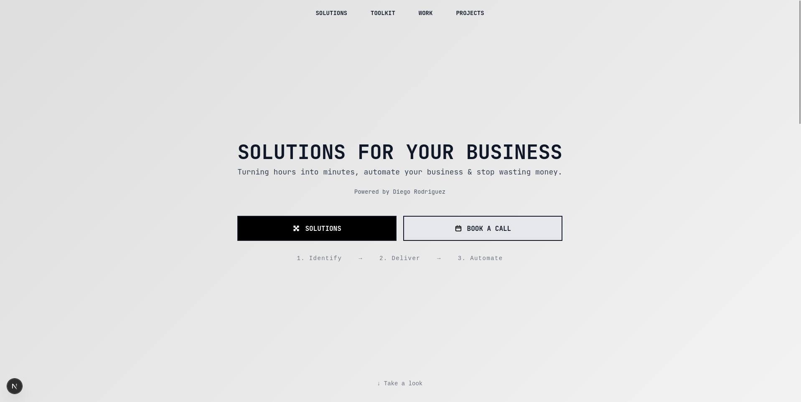

# [`justdiego.com`](https://justdiego.com) - Portfolio & Solutions Platform
---




---

## Why?
This repository is the backbone of justdiego.com , a platform built to deliver real business solutions.

- It exists to centralize, automate, and ship tools that expose inefficiencies, fix vulnerabilities, and save companies money.

- All code here is focused on turning manual hours into automated minutes.

- If your business is leaking cash or time, this platform is designed to find it and kill it, fast.

## Features
- **Solutions Marketplace**: Browse and deploy solutions tailored to your business needs.


- **Client Reviews**: Read real feedback from clients who have used the solutions.


- **Attachment Gallery**: View and manage attachments related to client reviews.


- **Admin Dashboard**: Manage companies, solutions, and client reviews with ease.


# Installation
1. Clone the repository:
    ```bash
    git clone https://github.com/dewstouh/justdiego.git
    ```

2. Navigate to the project directory:
    ```bash
    cd justdiego
    ```

3. Install dependencies using [pnpm](https://pnpm.io/):
    ```bash
    pnpm install
    ```
4. Set up environment variables:
    - Create a `.env` file in the root directory.
    - Copy the contents of `.env.example` to `.env` and update the values as needed.
    - Make sure to set up your database connection and any other required environment variables.
    - For local development, you can use SQLite or set up a PostgreSQL database.

5. Initialize the project:
    ```bash
    pnpm run dev
    ```

6. Access the application:
    - Open your browser and go to `http://localhost:3000` to view the platform.

## Docker Setup
The fastest way to get Quick Status running:

```bash
# Option 1: Build and run directly from GitHub
docker build -t justdiego https://github.com/dewstouh/justdiego.git#main:docker/images/justdiego
docker run -p 3000:3000 justdiego

# Option 2: Clone and use docker-compose
git clone https://github.com/dewstouh/justdiego.git
cd justdiego/docker/images/justdiego
docker compose up
```

Visit http://localhost:3000 to see the page!

# License
justdiego.com is licensed under the [MIT License](./LICENSE).

- Feel free to use, modify, and distribute this code for personal or commercial projects.
- No attribution is required, but contributions and improvements are welcome.
- Please ensure that any modifications or derived works also comply with the MIT License.

# Contributing
Contributions are welcome to improve the platform. If you have ideas, bug fixes, or enhancements, please submit a pull request.

Read the [Contributing Guidelines](./.github/CONTRIBUTING.md) before submitting changes.

# History behind justdiego.com
justdiego.com was born out of frustration with slow, bloated business tools and the constant waste of time and money in companies that should know better.

The project started as a personal mission to destroy inefficiency wherever it hides, first for individual businesses, then for anyone smart enough to use the platform.

No investors, no corporate bullshit, just real solutions built from the ground up by someone who’s tired of watching people do things the hard way.

Everything you see here is the result of shipping fast, automating aggressively, and solving real problems without compromise.

> *Diego Rodriguez, Founder & CTO — justdiego.com*